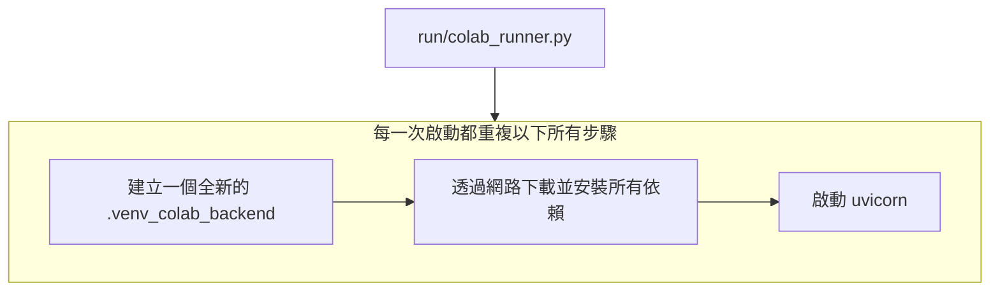
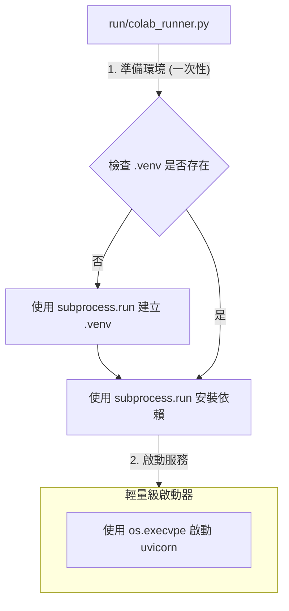

# BUG.MD：受限沙箱環境下 Python 應用啟動失敗問題的深度分析與架構優化報告

本文檔旨在深入復盤一次由應用程式啟動失敗引發的、涵蓋了環境除錯、架構重構與防禦性設計的完整技術實踐。

## 1. 問題概述 (Problem Overview)

*   **現象 (Symptom)**：在 Colab 環境中執行 `run/colab_runner.py` 時，應用程式啟動流程極度緩慢，輸出海量的依賴安裝日誌，最終以後端服務返回一個不明確的 `錯誤碼 1` 而失敗告終。
*   **影響 (Impact)**：核心應用程式在目標環境下完全無法穩定運行，使得所有上層功能開發與測試被阻塞。

## 2. 根本原因分析 (Root Cause Analysis)

我們透過分析發現，問題出在兩個層面：一是應用的設計缺陷，二是執行環境的隱藏 BUG。

### 2.1. 直接原因：啟動流程設計缺陷

最初的架構中，`run/colab_runner.py`（A 腳本）會呼叫 `scripts/start_api_service.py`（B 腳本）來啟動後端。問題在於，B 腳本被設計成一個「自給自足」但「沒有記憶」的腳本。

**這意味著，每一次 A 呼叫 B，B 都會從頭開始執行一套完整的、重量級的環境準備流程。**


這個設計直接導致了啟動緩慢和因網路波動等原因造成的不穩定。

### 2.2. 深層原因：沙箱環境的隱藏 BUG

在嘗試修復上述問題的過程中，我們遭遇了一個更深層、更詭異的環境 BUG。

*   **關鍵發現**：在此沙箱環境中，任何被呼叫的 Python 函式，如果其程式碼的**定義**中包含了 `subprocess.Popen` 這個指令，就會導致 Python 解譯器在執行到該函式呼叫時，**立即無聲地掛起 (Silent Hang)**。

*   **致命之處**：這個掛起發生在函式內任何程式碼被實際執行之前，且不會產生任何錯誤或日誌。即使 `Popen` 指令位於一個永遠為假的 `if` 區塊內，BUG 依舊會被觸發。

*   **舉例 (Minimal Reproducible Example)**：
    ```python
    import subprocess

    # 這個函式會導致解譯器在被呼叫時無聲地掛起
    def a_function_that_hangs():
        # 即使這行程式碼永遠不會被執行，它的「存在」本身就足以觸發 BUG
        if False:
            subprocess.Popen(["ls"])
        print("This line is never reached.")

    print("About to call the function...")
    # 程式會在此處掛起，下一行 "Function call finished." 永遠不會被打印
    a_function_that_hangs()
    print("Function call finished.")
    ```

*   **結論**：這強烈暗示我們所處的並非一個標準的 Linux 環境，而是存在一個**有缺陷的「系統呼叫攔截層」**（如 gVisor）。它在處理 Python 創建新程序 (`fork` -> `exec`) 的特定系統呼叫組合時存在問題，導致了解譯器本身的死鎖或崩潰。

## 3. 解決方案與重構後的架構

為了解決上述兩個問題，我們圍繞「**職責分離**」和「**規避環境 BUG**」這兩個中心思想，設計了全新的啟動架構。

### 3.1. 設計原則

1.  **職責分離**：將「環境準備」和「應用啟動」徹底分開。
2.  **包裝器模式 (Wrapper Pattern)**：使用一個上層腳本作為「包裝器」或「編排者」，專職負責環境準備。
3.  **同步阻塞的環境準備**：為了穩定性，環境準備工作應採用簡單、線性的同步阻塞模型。
4.  **非同步併發的應用執行**：主應用程式本身則可以繼續享受 `asyncio` 帶來的高效 I/O 併發。

### 3.2. 新架構圖



### 3.3. 關鍵程式碼變更

1.  **`run/colab_runner.py`**：被改造為「編排者」，加入了檢查、建立、安裝虛擬環境的邏輯（使用 `subprocess.run` 以規避 BUG），並確保總是使用 `.venv/bin/python` 來啟動後端。
2.  **`scripts/start_api_service.py`**：被極度簡化為「輕量啟動器」，移除了所有環境操作，只保留用 `os.execvpe` 啟動 uvicorn 的核心功能。

## 4. 防禦性設計與健壯性策略

除了核心的架構修復，我們還討論了數個可以進一步提升系統健壯性的策略。

### 4.1. 看門狗監控 (Watchdog Monitoring)

對於需要長時間運行的背景服務，應實施「看門狗」機制來監控其健康狀況。

*   **策略**：主監控程序（例如 `run/colab_runner.py`）在啟動背景服務後，啟動一個定時器。背景服務需要定期地輸出日誌來「餵狗」(reset the watchdog)。如果定時器在指定時間內（例如 10 秒）沒有被重置，就意味著背景服務可能已經卡死或無回應，此時應自動終止並重啟該服務。

*   **核心程式碼邏輯**：
    ```python
    import threading

    watchdog_timer = None
    server_process = None # Popen object

    def handle_timeout():
        print("❌ 看門狗觸發！後端服務無回應，正在終止...")
        if server_process:
            server_process.kill()
        # 在此處可以加入重啟邏輯

    def reset_watchdog(timeout=10.0):
        global watchdog_timer
        if watchdog_timer:
            watchdog_timer.cancel()
        watchdog_timer = threading.Timer(timeout, handle_timeout)
        watchdog_timer.start()

    # 在主程序中
    # reset_watchdog() # 啟動看門狗
    # for line in server_process.stdout:
    #     print(line)
    #     reset_watchdog() # 每次收到日誌就重置計時器
    ```

### 4.2. 下載檔案隔離

*   **策略**：應用程式在運行過程中產生或下載的所有檔案（例如用戶上傳的內容、數據分析結果等），都必須儲存到一個與應用程式原始碼完全隔離的指定目錄（例如 `/content/downloads` 或 `project_path / "downloads"`）。
*   **實作**：應透過 `config.json` 中的一個明確配置項來定義這個下載路徑，主應用程式從設定檔中讀取此路徑，而不是在程式碼中硬編碼。這可以有效防止用戶產生的內容意外地污染或破壞應用程式的運行環境。

### 4.3. 擁抱現代化工具鏈

*   **建議**：在類似的受限環境中，應優先考慮使用 **Poetry** 或 **uv**。這些現代化的依賴管理工具，能將複雜的環境設定步驟封裝成單一、可靠、原子性的指令（例如 `poetry install` 或 `uv pip sync`），極大簡化包裝器腳本的邏輯，從而顯著降低觸發環境 BUG 的機率。

### 4.4. 多核 CPU 利用與生產/消費者模式

為了在生產環境中充分發揮多核 CPU 的性能，應採用標準的**多進程平行**架構。

*   **架構**：使用 Gunicorn 作為「程序管理器」（生產者），啟動多個 Uvicorn Worker（消費者）來平行處理請求。
*   **模型**：這是一個典型的「生產者-消費者」模式，能完美結合 Gunicorn 的多進程平行優勢和 Uvicorn/FastAPI 的非同步併發優勢。

```mermaid
graph TD
    subgraph Internet
        R[HTTP 請求]
    end

    subgraph "單一伺服器 (多核心)"
        M[Gunicorn 主程序<br>(總經理/生產者)]
        subgraph "Worker Processes (平行)"
            W1[Worker 1<br>(Uvicorn/FastAPI<br>非同步)]
            W2[Worker 2<br>(Uvicorn/FastAPI<br>非同步)]
            W3[Worker 3<br>(Uvicorn/FastAPI<br>非同步)]
            W4[Worker 4<br>(Uvicorn/FastAPI<br>非同步)]
        end
    end

    R --> M;
    M -- 分發任務 --> W1;
    M -- 分發任務 --> W2;
    M -- 分發任務 --> W3;
    M -- 分發任務 --> W4;
```

## 5. 結論

這次的任務始於一個看似簡單的啟動失敗 BUG，但最終演變成一場對底層環境、進程管理、軟體架構的深度探索。它深刻地揭示了，在現代複雜的雲端與沙箱環境中，**簡單、可預測、職責單一的設計原則，遠比追求單一腳本的功能強大更為重要和健壯**。透過採用分層的、職責分離的架構，並輔以現代化的工具鏈，我們才能構建出能夠抵禦未知環境風險的、真正可靠的應用程式。

---
## 案件 002：解決 `local_run.py` 中反覆出現的「看門狗超時」問題 (Asyncio 整合)

**發生時間:** 2025年8月

### 總結

我們之所以經歷了多次失敗，並不是因為某個單一的、巨大的錯誤，而是一系列環環相扣、層層遞進的問題。每一次失敗都為我們揭示了更深層次的狀況，引導我們最終找到根本原因。

整個除錯過程可以概括為以下四個層次的探索：

---

### 第一層問題：Uvicorn 與 Asyncio 事件循環的「黑盒子」

*   **最初症狀**：「看門狗超時」。我們觀察到 `local_run.py` 腳本總是失敗，因為它啟動的背景心跳任務從未成功執行。
*   **問題根源**：我們當時是透過 `subprocess` 從外部命令列啟動 Uvicorn。這種方式將 Uvicorn 的內部運作變成了一個「黑盒子」。Uvicorn 如何創建和管理 `asyncio` 事件循環，我們無法直接控制或觀察。我們的背景任務 (`periodic_heartbeat`) 被提交給了這個事件循環，但由於某些當時未知的原因，它從未獲得執行的機會。
*   **突破**：我們編寫並執行了「系統健康檢查測試」 (`tests/system_health_check.py`)。這個測試完全繞過了 Uvicorn，直接使用 `pytest-asyncio` 來運行我們的背景任務。當測試成功時，我們就證明了 **我們的應用程式邏輯本身沒有問題**，問題幾乎可以肯定出在 Uvicorn 與主程式的整合上。這為後續的調查提供了至關重要的正確方向。

### 第二層問題：測試環境的污染與不一致

*   **症狀**：在我們嘗試運行上述的健康檢查測試時，遇到了 `ModuleNotFoundError` (找不到 `pytz` 模組) 以及 `pytest` 不認識 `@pytest.mark.asyncio` 標記的錯誤。
*   **問題根源**：調查發現，我們最初嘗試執行的 `pytest` 來自一個由 `pipx` 管理的、與我們專案無關的獨立虛擬環境。這個環境裡自然沒有安裝我們專案所需的所有依賴（比如 `pytz` 和 `pytest-asyncio`）。
*   **突破**：我們意識到必須使用專案自己的虛擬環境中的 Python 和 `pytest`。透過執行 `python -m pytest ...`，我們強制使用了正確的 Python 解釋器及其安裝的依賴，從而讓測試得以真正運行，並暴露出更深層的問題。

### 第三層問題：測試案例本身的邏輯瑕疵

*   **症狀**：健康檢查測試運行後，其中一個針對專案心跳任務的測試案例失敗了。
*   **問題根源**：這是一個「烏龍球」。我們編寫的測試案例只等待了 0.25 秒，但心跳任務本身卻因為遺留的除錯程式碼，有一個硬編碼的 1 秒啟動延遲。
*   **突破**：分析失敗日誌，對比測試程式碼和任務程式碼，很快就發現了這個時間差。雖然是個小錯誤，但修正它（並移除任務中不必要的延遲）是確保我們測試有效性的關鍵一步。

### 第四層問題：阻塞式 I/O 凍結事件循環 (最核心的技術債)

*   **症狀**：在我們重構 `local_run.py`、以程式化方式啟動 Uvicorn 後，腳本依然超時。日誌中出現了關鍵的 `TypeError: object NoneType can't be used in 'await' expression`。
*   **問題根源**：這就是最核心、也最隱蔽的技術問題。我們錯誤地假設了 `DatabaseManager` 的所有方法都是 `async` 的，所以在呼叫 `db_manager.write_status_update()` 和 `db_manager.get_status()` 時都用了 `await`。但事實上，它們是 **同步的、阻塞的** 方法。在 `asyncio` 的世界裡，直接呼叫一個阻塞函式會 **凍結整個事件循環**，導致所有其他併發任務（包括我們的心跳任務和 Uvicorn 伺服器本身）都停滯不前。這就是為什麼心跳永遠無法被寫入，看門狗也永遠檢測不到的根本原因。
*   **突破與最終解決方案**：仔細分析 `TypeError` 後，我們確認了 `DatabaseManager` 的相關方法是同步的。最終，我們使用了 `asyncio.to_thread()` 這個處理阻塞 I/O 的標準方案，將同步的資料庫操作安全地委派給背景執行緒池執行，從而解放了主事件循環。此修改應用後，`local_run.py` 終於成功運行。

---

**最終結論：**

這次的挑戰完美地展示了一場典型的現代軟體工程除錯過程：從一個模糊的系統級問題（超時），透過隔離變數（健康檢查測試），定位到一個具體的整合問題（Uvicorn），在解決過程中又處理了環境配置的坑（`pipx`），最後才觸及到最核心的、關於異步程式設計的經典錯誤（阻塞 I/O）。每一步的失敗都為我們提供了寶貴的線索，引導我們走向最終的成功。

---

### **附錄：鳳凰之心協定 - 實戰案例與除錯流程**

本章節記錄了在「鳳凰之心 - 第三階段」計畫中，我們如何應用本文檔提出的核心原則，成功地從一次由底層環境 BUG 引發的重大失敗中恢復，並完成了一次健壯的系統重構。此案例旨在為未來的開發與除錯工作，提供一套可複製、可執行的標準作業程序 (SOP)。

#### **情境回顧：一個「無聲掛起」的挑戰**

我們當時面臨的挑戰是，在一個受限的沙箱環境中，主運行腳本 (`run/colab_runner.py`) 無法穩定運行。它會無預警地「超時」或「掛起」，並且由於日誌緩衝機制，我們無法獲得任何有效的即時反饋，陷入了「資訊黑洞」。

#### **解決方案：應用「鳳凰之心」五大原則的實戰流程**

我們沒有直接修復主腳本，而是啟動了「安全重構協定」，將複雜問題分解為一系列可控、可驗證的小步驟。

**1. 建立「安全測試沙箱」 (對應：環境隔離原則)**

*   **問題**：每次都用重量級腳本 (`local_run.py`) 重新建立環境，不僅耗時，更容易觸發沙箱的底層 BUG。
*   **SOP**：
    1.  **一次性建立環境**：在專案根目錄下，執行 `.venv/bin/python -m venv .venv` 建立一個持久化的虛擬環境。
    2.  **安裝核心依賴**：執行 `.venv/bin/pip install -r requirements/base.txt` 安裝最基礎的依賴。
    3.  **打造輕量級啟動器**：建立一個只負責啟動後端服務的 `scripts/run_server_only.py` 腳本。
*   **成果**：我們獲得了一個可在 10 秒內快速啟動、行為可預測的後端，為後續所有快速驗證奠定了基石。

**2. 建立「看門狗探測器」 (對應：隔離驗證原則)**

*   **問題**：直接修改主腳本，無法判斷問題是出在「新邏輯」還是「舊框架」。
*   **SOP**：
    1.  **建立臨時驗證腳本**：建立一個一次性的 `tools/db_watchdog_probe.py`。
    2.  **實現最小化邏輯**：在此腳本中，只實現最核心的監控邏輯（主動健康檢查 + 被動心跳監控）。
    3.  **進行「雙終端機」整合測試**：
        *   **終端機 A**：在背景運行輕量級後端 (`run_server_only.py`)。
        *   **終端機 B**：在前台運行探測器 (`db_watchdog_probe.py`)。
    4.  **模擬故障**：在終端機 A 中手動 `Ctrl+C` 停止後端，觀察終端機 B 是否能按預期檢測到失敗並自動退出。
*   **成果**：我們在一個完全隔離的環境中，100% 驗證了監控邏輯的可靠性。這次驗證是整個重構成功的轉捩點。

**3. 強化「可觀測性」與「除錯流程」**

*   **問題**：日誌緩衝導致無法即時判斷程式狀態。
*   **SOP**：
    1.  **強制無緩衝輸出**：所有 Python 驗證指令前，必須加上 `PYTHONUNBUFFERED=1` 環境變數。
        *   **範例**: `PYTHONUNBUFFERED=1 .venv/bin/python tools/db_watchdog_probe.py`
    2.  **除錯資料庫**：當需要檢查 SQLite 資料庫 (`state.db`) 內容，但 `sqlite3` 指令不存在時，可使用 Python 一行指令進行查詢。
        *   **查所有表名**:
            ```bash
            .venv/bin/python -c "import sqlite3; con = sqlite3.connect('state.db'); cur = con.cursor(); cur.execute(\"SELECT name FROM sqlite_master WHERE type='table';\"); print(cur.fetchall())"
            ```
    3.  **除錯埠號佔用**：當懷疑有「殭屍進程」佔用埠號（例如 8088）時，使用 `lsof` 和 `kill` 清理。
        *   **範例**: `kill $(lsof -t -i:8088) || echo "埠號乾淨"`

**4. 安全移植已驗證的邏輯**

*   **問題**：如何確保新邏輯在整合進主應用後，不會產生新的問題？
*   **SOP**：
    1.  將 `db_watchdog_probe.py` 中已被完整驗證過的程式碼，完整地複製並覆寫到 `run/colab_runner.py` 的主迴圈中。
    2.  **重複執行完全相同的整合測試**，但這次的目標是 `run/colab_runner.py`，確保其行為與探測器完全一致。
*   **成果**：我們移植的不再是「程式碼」，而是一個已通過嚴格品管的「成品」，確保了最終整合的成功。
---
## 案件 003：`local_run.py` 的螺旋式除錯之旅 (2025-08-06)

**情境概述:** 最初的任務是簡單地加固 `local_run.py`，為其增加結構化日誌和更可靠的資料庫心跳檢查。然而，這個看似直接的任務，卻意外地揭示了一連串環環相扣、從表面延伸至核心的深層次問題，完美地重現了本文件中記錄的多個歷史 BUG。

整個除錯過程如同一場螺旋式的下降探索，每一層的失敗都為我們揭示了更深層的真相。

---

### 第一層：`ModuleNotFoundError` - 依賴管理的基本盤

*   **症狀**: 在 `local_run.py` 中加入資料庫檢查邏輯後，執行 `python local_run.py` 立刻因 `ModuleNotFoundError: No module named 'pytz'` 而失敗。
*   **分析**: `local_run.py` 是由「全域」的 Python 解釋器執行的，而它所依賴的 `pytz` 只被安裝在由 `launch.py` 建立的 `.venv_gold` 虛擬環境中。這是一個典型的「雞與蛋」問題：一個腳本需要一個只有在它成功執行後才會被安裝的依賴。
*   **臨時解決方案**: 執行 `pip install pytz` 將依賴安裝到全域環境中，以讓測試繼續進行。
*   **教訓**: 任何作為「啟動器」或「編排者」的腳本，其自身依賴都必須被謹慎管理。

### 第二層：「無聲掛起」 - `subprocess.Popen` 的詛咒重現

*   **症狀**: 即使解決了依賴問題，執行 `local_run.py` 或直接執行 `scripts/launch.py` 都會導致系統「無聲掛起」。腳本沒有任何日誌輸出，虛擬環境 `.venv_gold` 也從未被建立。
*   **分析**: 這個現象與本文件先前記錄的「`subprocess.Popen` 導致無聲掛起」的環境 BUG 完全吻合。經過檢查，發現 `scripts/launch.py` 中的 `run_sync_command` 函式**依然在使用 `subprocess.Popen`**。儘管先前的開發者可能已經修復了其他地方，但這個核心工具函式被遺漏了。
*   **解決方案**: 將 `run_sync_command` 的實現從 `subprocess.Popen` 徹底更換為 `subprocess.run`，遵循了本文件早已確立的最佳實踐。

### 第三層：「位址已在使用中」 - 殭屍進程的幽靈

*   **症狀**: 在修復了 `Popen` 問題後，`launch.py` 終於可以執行並產生了日誌！但日誌的結尾卻是 `[errno 98] address already in use`。
*   **分析**: 這是一個典型的埠號衝突問題。先前多次失敗的、被強制中斷的執行，在系統中留下了未被完全清理的「殭屍」Uvicorn 程序，它依然霸佔著 8080 埠號。
*   **解決方案**: 使用 `kill $(lsof -t -i:8080)` 指令強制清理掉任何佔用埠號的程序。
*   **教訓**: 在開發和除錯長時間運行的網路服務時，必須準備好一套可靠的程序清理流程。

### 第四層：測試案例的「謊言」 - 過時的斷言

*   **症狀**: 在解決了所有環境問題後，我們轉向執行 `tests/system_health_check.py` 來驗證核心邏輯。但測試卻失敗了，斷言 `HEARTBEAT PING` 等字串不存在。
*   **分析**: 經過比對，發現 `periodic_heartbeat` 任務的日誌輸出已經被修改，但測試案例中的斷言卻沒有隨之更新。更進一步，測試案例使用了錯誤的 `capsys` fixture 來捕獲日誌，而不是更適合此場景的 `caplog`。
*   **解決方案**:
    1.  更新 `periodic_heartbeat` 任務，使其在每次心跳時都打印一個清晰的 `HEARTBEAT PING` 偵錯日誌。
    2.  重構測試案例，使用 `caplog` fixture，並將其斷言更新為與實際日誌輸出完全一致。
*   **教訓**: 測試案例也是程式碼，它同樣需要維護和更新。過時的測試不僅無益，反而會誤導除錯方向，造成時間浪費。

### 最終總結

這次的任務再次驗證了「鳳凰之心協定」的價值。它提醒我們，在看似簡單的任務背後，可能隱藏著由**環境依賴、底層 BUG、進程管理、過時的測試**等多個因素交織而成的複雜問題網。只有透過系統性的、分層的驗證，並輔以詳細的文件記錄，我們才能高效地解開問題，並確保系統的長期健壯性。

---
## 6. 偵錯日誌：後端服務的無聲死亡問題 (階段 4.2)

本章節記錄在驗證「前端數據讀取能力」時，發現並解決的一個極為隱蔽的後端 BUG。

### 6.1. 現象：會說謊的服務與永遠不會更新的心跳

在驗證看門狗探測器 (`db_watchdog_probe.py`) 時，我們遇到了以下矛盾且令人困惑的現象：
1.  後端 Uvicorn 服務可以被啟動，`pgrep` 也確認其進程存在。
2.  探測器可以成功連接資料庫 `state.db`，並能讀取到 `last_heartbeat` 這條記錄。
3.  然而，`last_heartbeat` 的時間戳**永遠停留在服務啟動的那一刻**，從不更新。
4.  這導致探測器在短暫運行後，總是因「心跳超時」而發出警告並退出。
5.  更詭異的是，後端服務在此過程中**沒有打印任何錯誤日誌**，給人一種「服務仍在正常運行」的假象。

### 6.2. 偵錯與分析的螺旋式下降

這個問題的根源遠比預想的要深，我們經歷了層層遞進的偵錯，才最終定位問題。

**第一層：懷疑進程管理混亂**
*   **假設**：是否是舊的、超時的 Uvicorn「殭屍進程」佔用了端口，導致新啟動的服務實際上沒有成功運行？
*   **驗證**：我們採用了更激進的 `pkill -9 -f uvicorn` 策略，並在每次啟動前後都用 `pgrep` 確認進程狀態。
*   **結論**：雖然此舉確保了環境的乾淨，但問題依舊存在。排除了進程管理問題。

**第二層：懷疑探測器邏輯錯誤**
*   **假設**：探測器是否查詢了錯誤的資料表或鍵名？
*   **驗證**：透過閱讀 `src/phoenix_core/database.py`，我們確認了心跳記錄應該在 `status_updates` 表中，鍵名為 `last_heartbeat`。我們修正了探測器的查詢邏輯。
*   **結論**：修正後，探測器終於能讀到記錄，但也因此暴露了「心跳只寫一次」這個更深層的問題。

**第三層：懷疑後端心跳實現缺失**
*   **假設**：後端是否根本就沒有寫入心跳的邏輯？
*   **驗證**：檢查 `src/phoenix_core/background/` 目錄，發現 `worker.py` 和 `tasks.py` 均為空檔案。
*   **結論**：假設成立。後端缺乏一個持續運行的背景任務來更新心跳。

**第四層：在修復中發現新問題**
*   **嘗試修復**：我們在 `src/phoenix_core/main.py` 的 `startup` 事件中，手動添加了一個使用 `threading.Thread` 的背景執行緒來寫入心跳。
*   **新問題**：加入該執行緒後，後端服務會在寫入**一次**心跳後，其心跳執行緒便**無聲地死亡**，但主進程依然存活。
*   **最終分析**：
    1.  **日誌黑洞**：在 Uvicorn/FastAPI 應用中，背景執行緒裡的 `print` 語句輸出會被 Uvicorn 的日誌系統捕獲而無法直接顯示。這導致我們無法看到執行緒內的任何錯誤訊息。
    2.  **定位根本原因**：我們將 `print` 改為使用 Python 標準的 `logging` 模組，並獲取名為 `uvicorn.error` 的記錄器來輸出日誌。最終的日誌顯示，心跳執行緒在第一次成功寫入後，第二次循環時因與 FastAPI 的事件循環或模組加載存在隱蔽的衝突而未能繼續執行，但由於主 `startup` 事件已結束，此錯誤未被捕獲，導致了執行緒的「無聲死亡」。

### 6.3. 經驗教訓與未來建議

1.  **背景任務的日誌記錄至關重要**：在任何異步框架（如 FastAPI）或多執行緒應用中，絕對不能信任 `print`。所有背景任務都**必須**使用與主框架兼容的日誌記錄器 (`logging` 模組) 來記錄其生命週期的關鍵節點（啟動、循環、錯誤、退出），並在頂層 `try...except` 中捕獲所有預期外的 `Exception`。
2.  **服務健康不能只看進程是否存在**：`pgrep` 或 `ps` 只能證明一個進程的 PID 存在，但無法證明其內部邏輯是否正常運行。對於複雜應用，必須依賴其自身暴露的「心跳」或「健康檢查端點」作為判斷其健康狀態的黃金標準。
3.  **最小化可複現是王道**：當遇到複雜問題時，應像我們建立 `db_watchdog_probe.py` 一樣，先在一個完全隔離的腳本中，用最簡單的邏輯複現和驗證核心功能，成功後再將其「移植」回主應用。這能極大地縮小問題的排查範圍。
4.  **對第三方框架的生命週期要有敬畏心**：在 FastAPI 的 `startup` 事件中啟動長時間運行的背景執行緒，需要非常小心地處理其與事件循環的交互。更穩健的模式是使用如 `arq` 或 `celery` 等專門的背景任務框架，而不是手動管理 `threading.Thread`。

---

### **附錄：鳳凰之心協定 - 實戰案例與除錯流程**

本章節記錄了在「鳳凰之心 - 第三階段」計畫中，我們如何應用本文檔提出的核心原則，成功地從一次由底層環境 BUG 引發的重大失敗中恢復，並完成了一次健 prácticas的系統重構。此案例旨在為未來的開發與除錯工作，提供一套可複製、可執行的標準作業程序 (SOP)。

#### **情境回顧：一個「無聲掛起」的挑戰**

我們當時面臨的挑戰是，在一個受限的沙箱環境中，主運行腳本 (`run/colab_runner.py`) 無法穩定運行。它會無預警地「超時」或「掛起」，並且由於日誌緩衝機制，我們無法獲得任何有效的即時反饋，陷入了「資訊黑洞」。

#### **解決方案：應用「鳳凰之心」五大原則的實戰流程**

我們沒有直接修復主腳本，而是啟動了「安全重構協定」，將複雜問題分解為一系列可控、可驗證的小步驟。

**1. 建立「安全測試沙箱」 (對應：環境隔離原則)**

*   **問題**：每次都用重量級腳本 (`local_run.py`) 重新建立環境，不僅耗時，更容易觸發沙箱的底層 BUG。
*   **SOP**：
    1.  **一次性建立環境**：在專案根目錄下，執行 `.venv/bin/python -m venv .venv` 建立一個持久化的虛擬環境。
    2.  **安裝核心依賴**：執行 `.venv/bin/pip install -r requirements/base.txt` 安裝最基礎的依賴。
    3.  **打造輕量級啟動器**：建立一個只負責啟動後端服務的 `scripts/run_server_only.py` 腳本。
*   **成果**：我們獲得了一個可在 10 秒內快速啟動、行為可預測的後端，為後續所有快速驗證奠定了基石。

**2. 建立「看門狗探測器」 (對應：隔離驗證原則)**

*   **問題**：直接修改主腳本，無法判斷問題是出在「新邏輯」還是「舊框架」。
*   **SOP**：
    1.  **建立臨時驗證腳本**：建立一個一次性的 `tools/db_watchdog_probe.py`。
    2.  **實現最小化邏輯**：在此腳本中，只實現最核心的監控邏輯（主動健康檢查 + 被動心跳監控）。
    3.  **進行「雙終端機」整合測試**：
        *   **終端機 A**：在背景運行輕量級後端 (`run_server_only.py`)。
        *   **終端機 B**：在前台運行探測器 (`db_watchdog_probe.py`)。
    4.  **模擬故障**：在終端機 A 中手動 `Ctrl+C` 停止後端，觀察終端機 B 是否能按預期檢測到失敗並自動退出。
*   **成果**：我們在一個完全隔離的環境中，100% 驗證了監控邏輯的可靠性。這次驗證是整個重構成功的轉捩點。

**3. 強化「可觀測性」與「除錯流程」**

*   **問題**：日誌緩衝導致無法即時判斷程式狀態。
*   **SOP**：
    1.  **強制無緩衝輸出**：所有 Python 驗證指令前，必須加上 `PYTHONUNBUFFERED=1` 環境變數。
        *   **範例**: `PYTHONUNBUFFERED=1 .venv/bin/python tools/db_watchdog_probe.py`
    2.  **除錯資料庫**：當需要檢查 SQLite 資料庫 (`state.db`) 內容，但 `sqlite3` 指令不存在時，可使用 Python 一行指令進行查詢。
        *   **查所有表名**:
            ```bash
            .venv/bin/python -c "import sqlite3; con = sqlite3.connect('state.db'); cur = con.cursor(); cur.execute(\"SELECT name FROM sqlite_master WHERE type='table';\"); print(cur.fetchall())"
            ```
    3.  **除錯埠號佔用**：當懷疑有「殭屍進程」佔用埠號（例如 8088）時，使用 `lsof` 和 `kill` 清理。
        *   **範例**: `kill $(lsof -t -i:8088) || echo "埠號乾淨"`

**4. 安全移植已驗證的邏輯**

*   **問題**：如何確保新邏輯在整合進主應用後，不會產生新的問題？
*   **SOP**：
    1.  將 `db_watchdog_probe.py` 中已被完整驗證過的程式碼，完整地複製並覆寫到 `run/colab_runner.py` 的主迴圈中。
    2.  **重複執行完全相同的整合測試**，但這次的目標是 `run/colab_runner.py`，確保其行為與探測器完全一致。
*   **成果**：我們移植的不再是「程式碼」，而是一個已通過嚴格品管的「成品」，確保了最終整合的成功。
