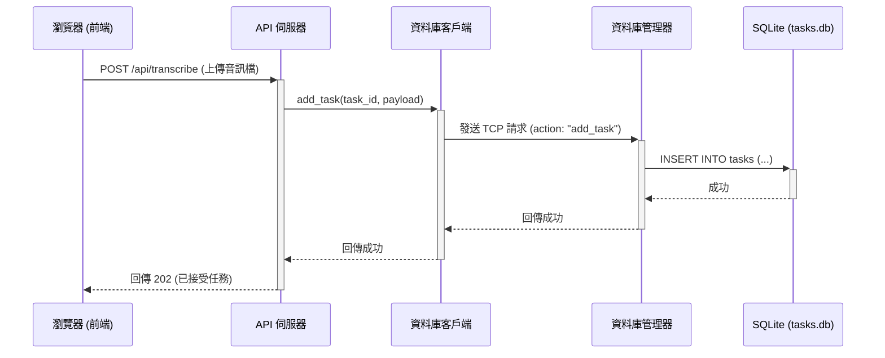

# 🏗️ 專案架構藍圖

本文檔闡述了「鳳凰音訊轉錄儀」專案當前採用的標準化、專業化專案架構。此架構的設計目標是實現**高度的模組化、清晰的職責分離、以及在不同環境下的穩定、可複現執行**。

---

## 1. 高層次設計哲學

我們遵循業界公認的 Python 專案最佳實踐，其核心思想包括：

- **源碼佈局 (Source Layout)**: 所有的核心應用程式碼都位於 `src/` 目錄下。這可以防止意外的、依賴相對路徑的導入，並確保專案被正確地安裝。
- **單一職責原則**: 每個檔案、每個模組、每個腳本都應該只有一個明確的、集中的職責。
- **程序隔離 (Process Isolation)**: 核心的後端服務（如 API 伺服器、資料庫管理器）被設計為獨立的程序，並由程序管理器 (`circus`) 統一監管，以提升穩定性並避免資源衝突。
- **依賴管理**: 所有依賴均在 `requirements.txt` (Python) 和 `package.json` (Node.js) 中進行顯式聲明，以保證環境的可複現性。
- **配置外部化**: 應用程式的配置（如服務啟動設定）與程式碼分離，統一存放在 `config/` 目錄中。

---

## 2. 目錄結構詳解

```
phoenix_transcriber/
├── .github/              # CI/CD 工作流程
├── .vscode/              # VS Code 編輯器設定
├── config/               # 所有環境設定檔 (circus.ini)
├── docs/                 # 專案文件
├── logs/                 # 執行時產生的日誌檔案
├── scripts/              # 各類輔助腳本 (部署、測試啟動器)
├── src/                  # 主要應用程式原始碼
│   ├── api/              # API 伺服器 (api_server.py)
│   ├── core/             # 核心商業邏輯 (orchestrator.py)
│   ├── db/               # 資料庫相關模組
│   ├── static/           # 靜態檔案 (HTML, CSS, 前端 JS)
│   ├── tasks/            # 背景任務/Worker (worker.py)
│   ├── tests/            # 所有測試檔案 (單元測試、E2E 測試)
│   └── tools/            # 專案使用的工具模組
├── .gitignore            # Git 忽略清單
├── package.json          # Node.js 專案依賴
├── playwright.config.js  # Playwright E2E 測試設定
├── pyproject.toml        # Python 專案設定
├── requirements.txt      # Python 專案依賴
└── README.md             # 專案主說明文件
```

### 核心元件職責

*   **`config/circus.ini.template`**: `circus` 程序管理器的設定檔模板。`run_tests.py` 會使用它來動態生成 `circus.ini`，並用其啟動後端服務。
*   **`scripts/run_tests.py`**: 官方的測試啟動器。它負責準備環境、啟動服務、執行 `pytest` 和 `playwright` 測試，並在結束後清理環境。
*   **`src/api/api_server.py`**: 基於 **FastAPI** 的 Web 伺服器。它是所有前端請求的入口，負責處理 HTTP 請求、與後端服務通訊，並提供 WebSocket 介面。
*   **`src/db/manager.py`**: 一個基於 TCP 的**資料庫管理器服務**。這是整個系統中**唯一**可以直接存取資料庫的程序，它作為一個「守門人」，接收來自其他服務的指令（如 `get_task`, `update_status`）來操作資料庫，從而避免了多程序同時寫入資料庫導致的鎖定和競爭問題。
*   **`src/db/database.py`**: 包含了所有與 **SQLite** 資料庫 (`tasks.db`) 互動的底層 SQL 邏輯。它定義了資料庫的結構 (Schema)，並提供了所有 CRUD (建立、讀取、更新、刪除) 操作的函式。
*   **`src/db/client.py`**: 一個 TCP 客戶端，封裝了與 `db_manager.py` 進行通訊的邏輯。`api_server.py` 等模組透過這個客戶端來間接地操作資料庫。
*   **`src/static/mp3.html`**: 專案的主要前端檔案，包含了所有的 HTML、CSS 和客戶端 JavaScript。

---

## 3. 執行流程與資料流

本專案的架構圍繞著幾個獨立但相互協作的程序。

### **程序啟動流程**

1.  **[開發者/CI]** 執行 `python scripts/run_tests.py` (或手動執行 `python -m circus.circusd config/circus.ini`)。
2.  **[Circus]** 根據 `config/circus.ini` 的設定，平行啟動兩個主要的背景服務：
    *   `python src/db/manager.py` (資料庫管理器)
    *   `python src/api/api_server.py` (API 伺服器)
3.  **[DB Manager]** 在啟動時，呼叫 `database.initialize_database()`，建立 `tasks.db` 資料庫以及其中的資料表 (`tasks`, `system_logs`, `app_state`)。
4.  **[API Server]** 啟動並開始監聽 HTTP 請求。

### **一般操作資料流 (以轉錄任務為例)**



### **UI 狀態保存與讀取流程 (V69 新增)**

```mermaid
sequenceDiagram
    participant Browser as 瀏覽器 (前端)
    participant APIServer as API 伺服器
    participant DBClient as 資料庫客戶端
    participant DBManager as 資料庫管理器
    participant Database as SQLite (tasks.db)

    Note over Browser, Database: 頁面載入時
    Browser->>+APIServer: GET /api/app_state
    APIServer->>+DBClient: get_app_state(key='ui_settings')
    DBClient->>+DBManager: TCP 請求 (action: "get_app_state")
    DBManager->>+Database: SELECT value FROM app_state WHERE key='ui_settings'
    Database-->>-DBManager: 回傳 JSON 字串
    DBManager-->>-DBClient: 回傳 JSON 字串
    DBClient-->>-APIServer: 回傳 JSON 字串
    APIServer-->>-Browser: 回傳 JSON 物件
    Browser->>Browser: applyStateToUI() (更新介面)

    Note over Browser, Database: 使用者修改設定時 (例如，更改模型)
    Browser->>Browser: appState.whisperModel = 'large-v3'; saveState();
    Note right of Browser: (Debounced)
    Browser->>+APIServer: POST /api/app_state (body: appState JSON)
    APIServer->>+DBClient: set_app_state(key='ui_settings', value=...)
    DBClient->>+DBManager: TCP 請求 (action: "set_app_state")
    DBManager->>+Database: INSERT OR REPLACE INTO app_state (...)
    Database-->>-DBManager: 成功
    DBManager-->>-DBClient: 成功
    DBClient-->>-APIServer: 成功
    APIServer-->>-Browser: 回傳 200 OK
```

---

## 4. 資料庫結構

資料庫 (`src/db/tasks.db`) 包含三個主要的資料表：

1.  **`tasks`**:
    *   **用途**: 儲存所有長時任務（如轉錄、下載）的狀態、進度和結果。
    *   **核心欄位**: `task_id` (TEXT, UNIQUE), `status` (TEXT), `progress` (INTEGER), `payload` (TEXT), `result` (TEXT), `type` (TEXT), `depends_on` (TEXT)。

2.  **`system_logs`**:
    *   **用途**: 儲存來自系統各個部分（前端、後端）的結構化日誌，用於除錯和監控。
    *   **核心欄位**: `timestamp` (DATETIME), `source` (TEXT), `level` (TEXT), `message` (TEXT)。

3.  **`app_state` (V69 新增)**:
    *   **用途**: 一個簡單的鍵值對儲存，用於持久化前端 UI 的狀態。
    *   **核心欄位**: `key` (TEXT, PRIMARY KEY), `value` (TEXT)。目前主要使用 `key='ui_settings'` 來儲存一個包含所有 UI 設定的 JSON 字串。

---

此架構透過清晰的職責劃分和程序隔離，確保了專案在不同場景下的健壯性和可維護性，為未來的迭代開發奠定了堅實的基礎。
